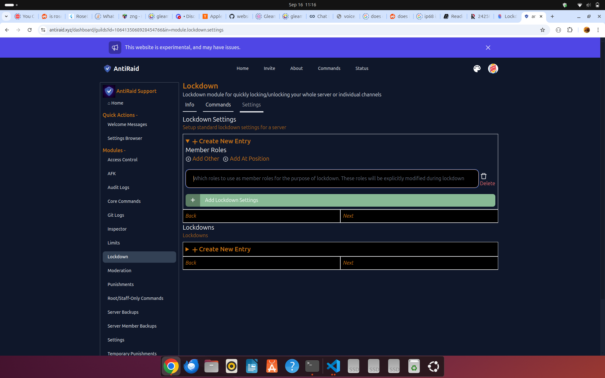
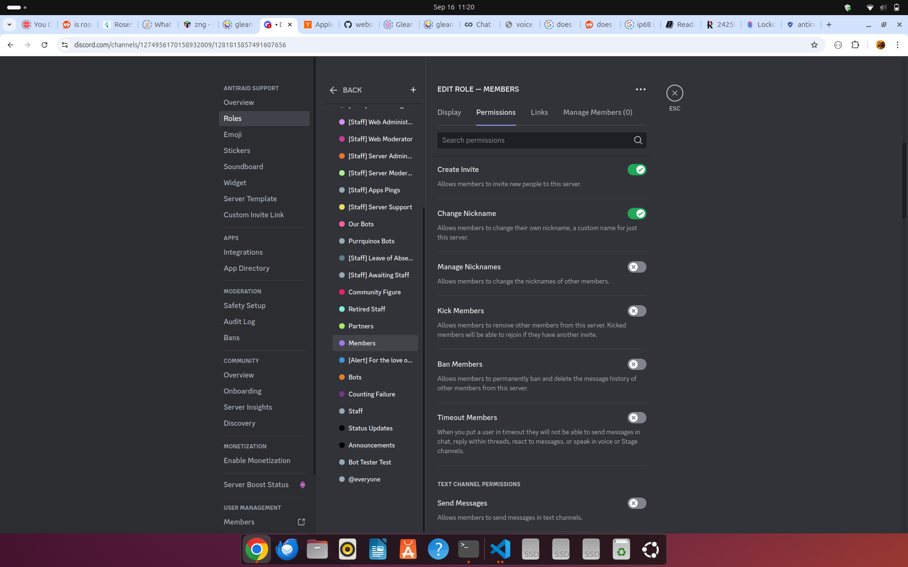
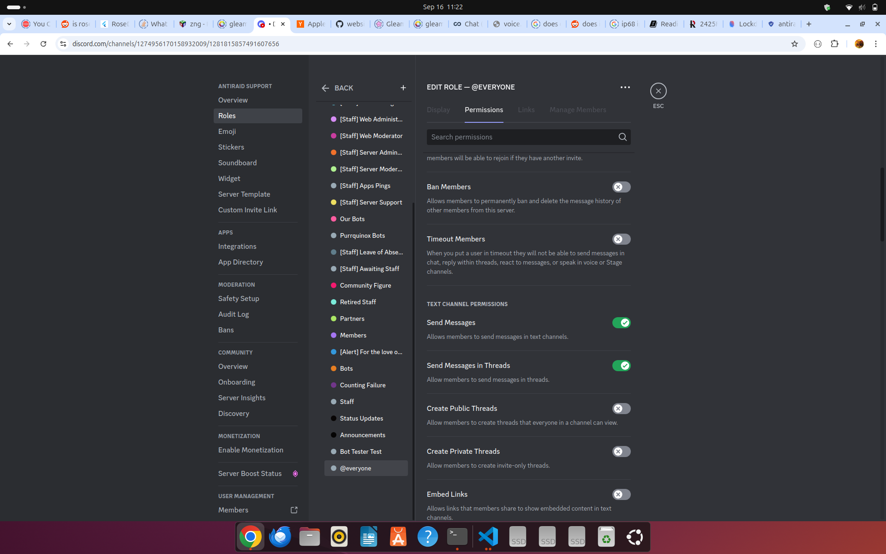

# Lockdowns

Lockdowns are a way to allow restricting (or 'locking down') specific channels or roles within a server when under an attack or other such crises.

## Migrating from other bots

If you are coming from Wick or another anti-nuke bot like Wick, please note that AntiRaid's lockdown functionality only applies to locking down channels and roles. This means that the following Wick features are not present in AntiRaid lockdowns and are instead part of other more appropriate modules as listed below:

- Join Auto Kick (present in Inspector Auto Response Member Join)
- Join Auto Ban (present in Inspector Auto Response Member Join)
- Role Lockdown (WIP, not yet implemented)
- All / Server Wide (Most likely will not be implemented)

Note that blind lockdowns are not yet implemented in Anti-Raid.

For the sake of comparisons, here is how each lockdown mode compares to Wick's lockdown modes:

- Quick Server Lockdown (`qsl`) -> Wick's Channels (`sc`) lockdown (general performance+requirements for use should be the same as Wick's lockdown feature)
- Traditional Server Lockdown (`tsl`) -> No equivalent in Wick
- Single-Channel Lockdown (`scl`) -> Wick's Channel (`c`) lockdown (note that locking down multiple specific channels at once is not yet implemented in AntiRaid)

## Usage Notes

If you want to know more details on each type of lockdown, how they are applied and how multiple lockdown conflicts are resolved, please refer to the [dev docs for lockdown](../../dev/rust_bot_modules_lockdown/README.md)

## Member Roles

When you first setup lockdown for the first time, you will be prompted for a set of member roles like below:



These roles are what AntiRaid will actually lock-down which is why they are also known as 'critical roles'.

## Quick Server Lockdowns

For servers that can meet its restrictions, a quick server lockdown is the fastest way to lockdown your server in a raid. It is recommended to use this lockdown mode if possible. When using this mode, it is important to note one critical requirement: 

- All critical roles must have View Channel and Send Messages. All other roles must not have View Channel and Send Messages.

What this looks like is something like the following:


*Figure 1 shows a normal role without View Channel of Send Messages permissions*


*Figure 2 shows a critical role with View Channel and Send Messages permissions*

The above two figures are how you want to configure your critical/member and normal roles. Basically, turn off View Channel and Send Messages for all your normal roles and turn it on for your critical/member roles you set up earlier in the settings for lockdown.

To make a quick server lockdown, you can use the ``qsl`` type. For example, to lock down a server, you can use the following slash command:

```
/lockdown lock type:qsl reason:There is a raid going on
```

## Traditional Server Lockdown

Traditional Server Lockdown is a more traditional lockdown method. It is more flexible than Quick Server Lockdown as it has no required prior setup. However, it is much slower and should be avoided if possible.


**WARNING:** Super large servers may have outages when using a traditional server lockdown that a quick server lockdown may not lead to.

To make a traditional server lockdown, you can use the ``tsl`` type. For example, to lock down a server, you can use the following slash command:

```
/lockdown lock type:tsl reason:There is a raid going on
```

## Single-Channel Lockdown

In some cases, only a single channel needs to be locked down. In such a case, a single-channel lockdown is needed.

To make a single-channel lockdown, you can use the ``scl`` type. For example, to lock down a server, you can use the following slash command:

```
/lockdown lock type:scl/<channel_id> reason:There is a raid going on
```

Where ``<channel_id>`` is the ID of the channel to lockdown.