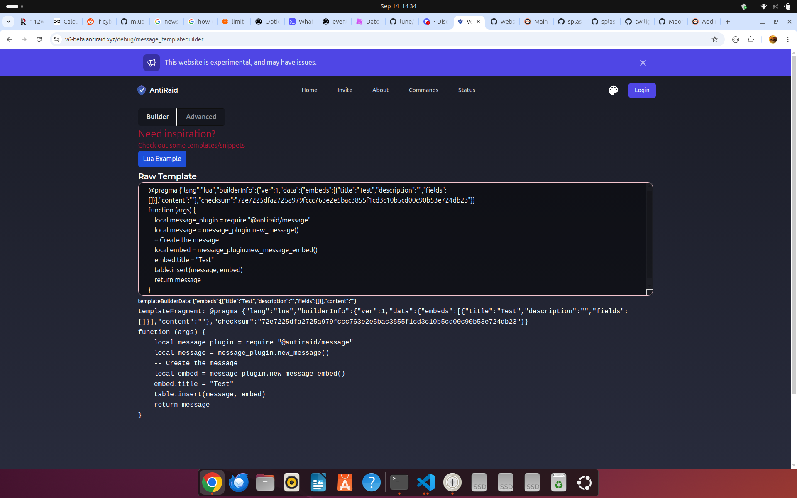

# Example Templates

To help you get started with templating, we have provided a few examples below along with explanations of what/how they work

# Example 1: Simple Embed

## Explanation

### 1. Pragma

The first line of the template is a pragma. This is a special statement beginning with ``@pragma`` that tells AntiRaid what language the template is written in, what options to use, and how tools such as CI, websites and other automation should handle your template. The rest of the pragma is a JSON object that contains the options. 

In this case, we are telling AntiRaid that this template is written in Lua (the ``{"lang":"lua"}``) with default options.

In case you're still confused by the pragma, here is a case where pragma *is* helpful



```json
{"lang":"lua","builderInfo":{"ver":1,"data":{"embeds":[{"title":"Test","description":"","fields":[]}],"content":""},"checksum":"72e7225dfa2725a979fccc763e2e5bac3855f1cd3c10b5cd00c90b53e724db23"}}
```

Here, notice that the builderInfo contains the embeds, content, and checksum of the template. When the user wants to reread their template, the website only has to reread the pragma statement to reconstruct the state and show the right tab (either Builder if they are just making a simple embed, or Advanced if they were making changes to the content of the template itself). Without the pragma, the website would have to use its own arcane syntax on top of comments or execute the template just to reconstruct state.

### 2. Function

All lua templates must be wrapped in a function to ensure clarity and to allow typing. This function takes a single argument, ``args``, which is a table containing the arguments passed to the template.

### 3. Setup

Before doing anything regarding messages, we first need to import the message plugin. The message plugin is a part of the AntiRaid SDK and provides functions for creating messages and embeds. This is done using the ``require`` statement like below:

```lua
local message_plugin = require "@antiraid/message"
```

Next, we create the embed using the ``new_message_embed`` function. This function creates a new message embed table that we can then modify. The ``event_titlename`` is an example of an argument that is passed. This specific argument is specific to Gateway Events and contains the friendly name for an event.

```lua
-- Make the embed
local embed = message_plugin.new_message_embed()
embed.title = args.event_titlename
embed.description = "" -- Start with an empty description
```

**NOTE: You can use the [API Reference](./2-plugins.md) to see what functions are available in the AntiRaid SDK**

### 4. Adding fields

**TIP: When making a template for a Gateway Event, the fields are passed to the template through a table named ``fields``.**

The next step is to add fields to the embed. In this case, we can do this by iterating over ``fields``. In Lua, tables can be iterated over using the builtin ``pairs`` function like below:

```lua
for key, value in pairs(my_table) do
    -- Do something with key and value
end
```

In the same way, we can now iterate over ``args.event_data``:

```lua
for key, value in pairs(args.event_data) do
    -- Do something with key and value
end
```

When using Gateway Events, there are two cases to pay attention to, the first is the field itself being ``nil`` and the second is the field type being ``None``. In both cases, we don't want to add the field to the embed. Lets do that!

```lua
    local should_set = false

    if value ~= nil and value.field.type ~= "None" then
        should_set = true
    end
```

Lastly, we need to format the field and add it to the description. Luckily, the message plugin provides a function for formatting any categorized field. This function is called ``format_gwevent_field``. 

```lua
local formatted_value = message_plugin.format_gwevent_field(value)
```

Finally, we can put the entire loop together as so:

```lua
-- Add the fields to the description
for key, value in pairs(args.event_data) do
    local should_set = false

    if value ~= nil and value.type ~= "None" then
        should_set = true
    end

    if should_set then
        local formatted_value = message_plugin.format_gwevent_field(value)
        embed.description = embed.description .. "**" .. key:gsub("_", " "):upper() .. "**: " .. formatted_value .. "\n"
    end
end
```

### 5. Creating the message

So far, we only have the embed. To create the message, we need to create a new message table and insert the embed into it. This is done using the ``new_message`` function and the ``table.insert`` function like below:

```lua
local message = message_plugin.new_message()

table.insert(message.embeds, embed)
```

Pro tip: ``table.insert`` is a function that inserts an element into a table. It is a Lua builtin, not an AntiRaid SDK function.

### Result

The final result of putting the above together is actually AntiRaids default template for Gateway Events (yes, actually!)

```lua
@pragma {"lang":"lua"}
function (args) 
    local message_plugin = require "@antiraid/message"

    -- Make the embed
    local embed = message_plugin.new_message_embed()
    embed.title = args.event_titlename
    embed.description = "" -- Start with an empty description

    -- Add the fields to the description
    for key, value in pairs(args.event_data) do
        local should_set = false

        if value ~= nil and value.type ~= "None" then
            should_set = true
        end
    
        if should_set then
            local formatted_value = message_plugin.format_gwevent_field(value)
            embed.description = embed.description .. "**" .. key:gsub("_", " "):upper() .. "**: " .. formatted_value .. "\n"
        end
    end

    local message = message_plugin.new_message()

    table.insert(message.embeds, embed)

    return message
end
```
