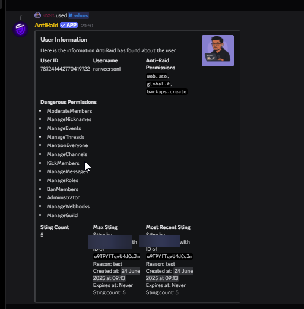

# Introduction

Provides basic information about a user regarding there:

- General Info
- Sting Count
- Permissions
- Anti-Raid Permissions

# Usage

this command can be ran by __any__ user by doing `/whois user:Username(optional)`

